## Пополнение библиотеки (на примере _GitHub Desktop_)

>"_Focus on what matters instead of fighting with Git._" - цитата на официальном сайте программы

### Порядок действий

1. Скачать программу с официального сайта (_https://desktop.github.com_) и установить ее

2. Запустить программу и дождаться появления приветственного окна

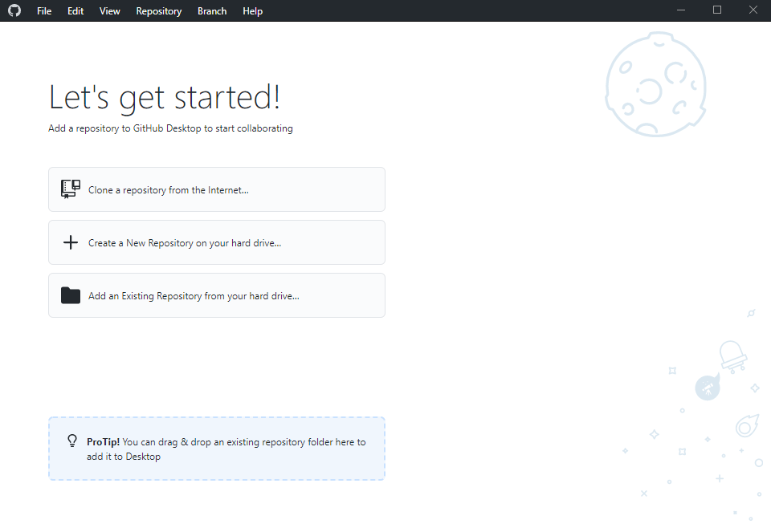

3. Пройти по пути _File -> Options_

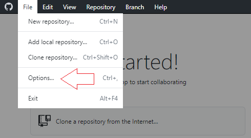

4. Во вкладке _Accounts_ для входа в свой личный аккаунт _GitHub_ нажать _Sign in_

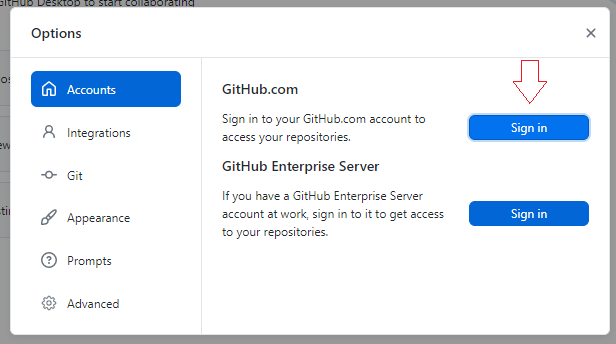

5. Ввести данные для входа и нажать _Sign in_

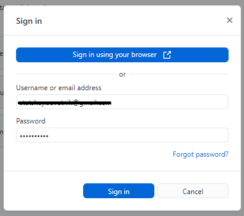

6. Для того, чтобы добавить репозиторий, есть два пути: 
    - Выбрать его из списка доступных в правой части окна
    - Клонировать репозиторий по интернет ссылке (этот вариант рассматривается далее)

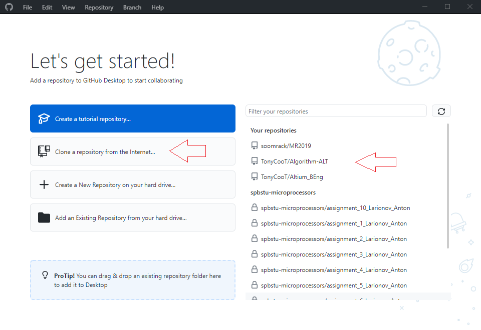

7. Ссылку можно найти на странице репозитория на _GitHub_, скопировав ее из выпадающего списка _Code -> HTTPS_

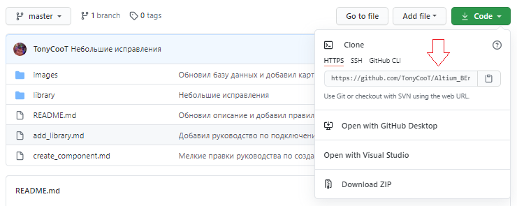

8. Нажав _Clone a repository from the Internet_ в меню программы и пройдя во вкладку _URL_, введите ссылку на сайт и желаемый путь для хранения локальной версии репозитория и нажмите _Clone_

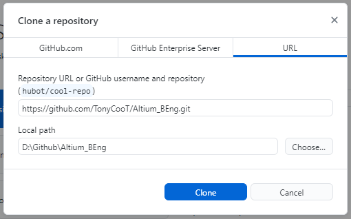

10. Вам откроется рабочее меню программы
    - В верхней части располагаются выпадающие списки _Current repository_ (текущий репозиторий), _Current branch_ (текущая ветка) и кнопка, с помощью которой можно как забрать изменения из глобального репозитория, так и отправить их в него. Текущие репозиторий и ветка остаются по умолчанию. 
    - Ниже находятся вкладки _Changes_ и _History_, в которых отображаются текущие изменения локального репозитория по сравнению с глобальным и история _commit_-ов.
    - В самом низу - поля ввода краткого содержания _Summary_ и описания _Description_ создаваемого _commit_-а, а также кнопка создания его локальной версии

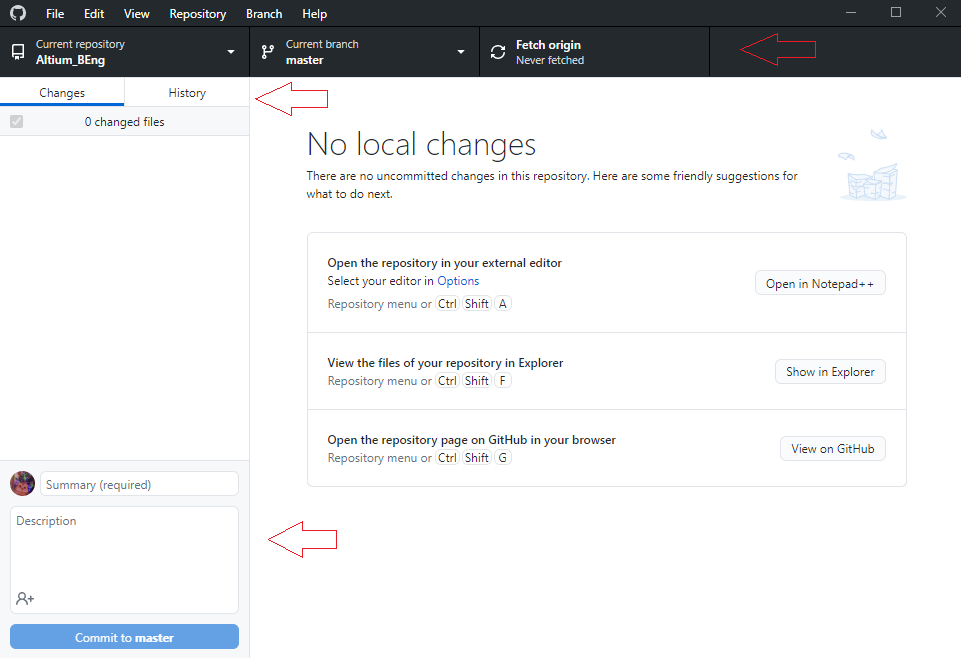

11. Для начала снова зайдите в настройки во вкладку _Git_ (_File -> Options -> Git_) и заполните поля _Name_ и _Email_. 
В _Name_ допускаются варианты, но желательно исходить из своих имени и фамилии.
При этом в качестве почты можно указать предложенный самим _GitHub_ вариант, который можно найти на странице своего аккаунта, пройдя по _Settings -> Emails_ (см. ниже)

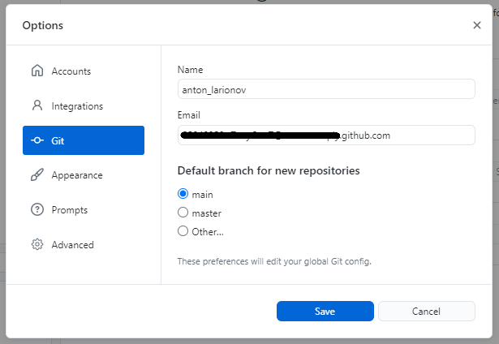

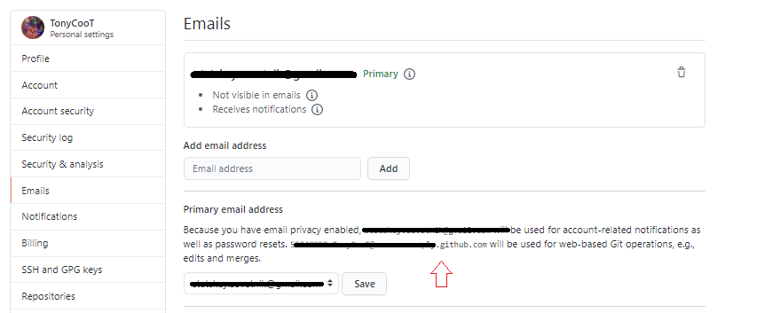

12. После клонирования репозитория по указанному ранее пути появятся все его файлы.
Попробуем добавить в библиотеку ~очередной~ резистор. Так как типовые УГО и посадочное место (добавляем резистор с типоразмером 0603) уже были добавлены в папки _sch_ и _pcb_, остается прописать его в таблице _Excel_

13. Добавим резистор на 1 кОм от компании _Yageo_ в таблицу, заполнив все поля по образцу данными из _datasheet_-а, и сохраним изменения

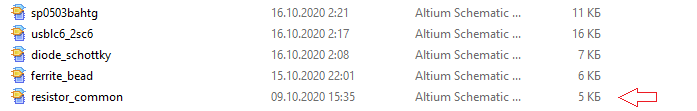

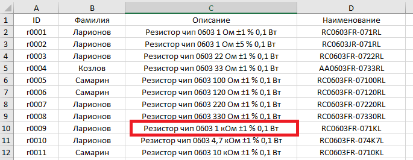

14. В меню программы во вкладке _Changes_ появится изменение, не синхронизированное с глобальной версией репозитория - отредактированный файл таблицы _Database_Students_.
Перед тем, как отправить его, необходимо заполнить поле для краткого(!) содержания. Например, "Добавил резистор" или "Добавил диодную сборку" или "Исправил таблицу" и др.
Поле для описания служит для более развернутого пояснения о сделанных изменениях, т.е. сюда пишется все остальное по мере необходимости.
После проверки корректности сделанных изменений и заполнения полей следует нажать _Commit to master_

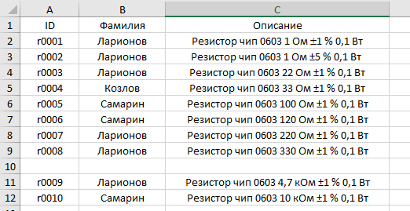

15. Локальный _commit_ создан! Во вкладке _History_ можно в этом убедиться. Для отправки изменений в глобальную версию репозитория нажмите на _Push origin_

16. В случае каких то проблем локальный _commit_ можно откатить во вкладке _Changes_, нажав _Undo_ напротив _commit_-а
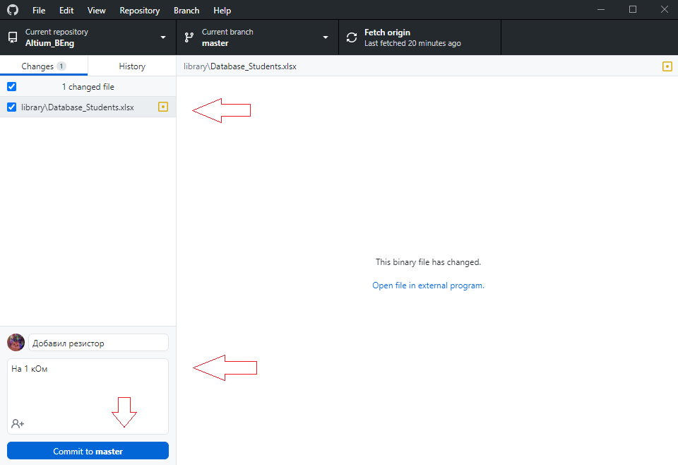

17. После успешной синхронизации сделанное изменение станет частью истории репозитория. Также в этом можно убедиться на странице репозитория на _GitHub_

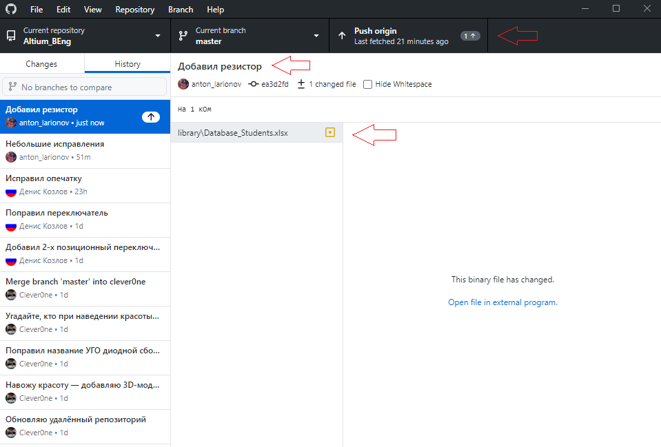

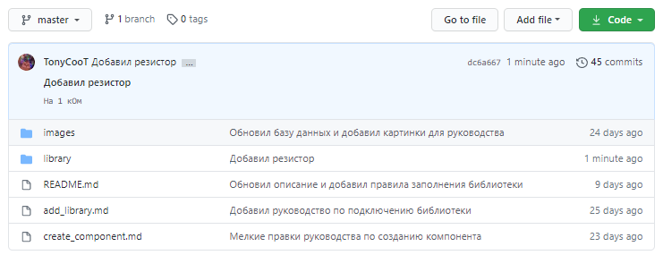
